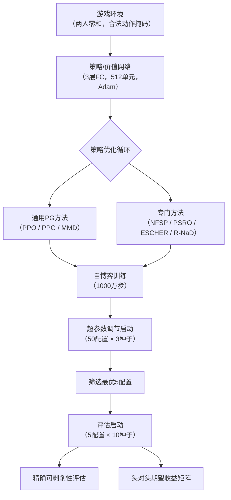

# Reevaluating Policy Gradient Methods for Imperfect-Information Games

> [!tip] 核心洞察
> 类似于磁性镜像下降（MMD）的通用策略梯度方法（PPO、PPG）天然具备「最大化期望收益 + 策略正则化 + 控制更新步长」三要素，只要给予适当的超参数（特别是更高的熵正则化），它们就能在非完全信息博弈中胜过基于FP、DO、CFR的复杂方法。

| 字段 | 内容 |
|------|------|
| 中文题名 | 重新评估非完全信息博弈的策略梯度方法 |
| 英文题名 | Reevaluating Policy Gradient Methods for Imperfect-Information Games |
| 会议/期刊 | ICLR 2026 (accepted) |
| Links | [paper](https://openreview.net/forum?id=vClBDezZUo) |
| Topic | #ICLR_2026 #topic/reinforcement_learning_planning_agents #topic/reinforcement_learning_planning_agents/deep_rl |
| Method | 通用策略梯度方法（PPO、PPG、MMD）配以适当调优 |
| Dataset | LD2D5F, DH3, ADH3, PTTT, APTTT（全部五个游戏）, LD2D5F, DH3, ADH3, PTTT, APTTT |

> [!tip] 效果简介
> - LD2D5F, DH3, ADH3, PTTT, APTTT（全部五个游戏） 上，exploitability 为 通用PG方法（MMD, PPO, PPG）可剥削性更低，对比 NFSP, PSRO, ESCHER, R-NaD 可剥削性更高，变化 通用PG方法在所有游戏中一致优于专门方法。
> - LD2D5F, DH3, ADH3, PTTT, APTTT 上，expected return 为 通用PG方法对阵专门方法获得正期望收益，对比 专门方法对阵通用PG方法获得负期望收益，变化 通用PG方法在头对头评估中全面占优。

## 概述

在非完全信息博弈（Imperfect-Information Games, IIGs）中，如何高效逼近纳什均衡策略是深度强化学习的核心挑战。现有方法主要基于三类博弈论算法：虚次对局（Fictitious Play, FP）、双神谕（Double Oracle, DO）和反事实遗憾最小化（Counterfactual Regret Minimization, CFR）。然而，这些方法在深度强化学习框架下存在结构性瓶颈——FP和DO需要在每一轮求解完整的强化学习问题，计算开销极大；基于CFR的方法则因重要性采样而引入高方差，且普遍缺乏last-iterate收敛保证。与此同时，通用策略梯度（Policy Gradient, PG）方法——如PPO、PPG——因历史偏见和优化不当，长期被认为不适用于非完全信息博弈。

本文重新评估了这一判断。核心发现是：**通用策略梯度方法具备“最大化期望收益 + 策略正则化 + 控制更新步长”三项要素，与磁性镜像下降（Magnetic Mirror Descent, MMD）在结构上高度相似**。只要给予适当的超参数调优——尤其是将熵正则化系数从主流库默认的0–0.01提升至0.05–0.2——PPO、PPG和MMD就能在自博弈中稳定收敛，并在可剥削性（exploitability）和头对头期望收益上全面超越专门设计的博弈论方法。

实验在五个两人零和非完全信息棋盘游戏（LD2D5F、DH3、ADH3、PTTT、APTTT）上进行，覆盖超过7000次训练运行。结果显示：NFSP、PSRO、ESCHER和R-NaD均未能在最终可剥削性上超过通用策略梯度方法（Figure 2）；在头对头评估中，通用PG方法对专门方法取得正期望收益（Figure 3）；最佳熵系数范围0.05–0.2显著偏离默认值，是成功的核心调优杠杆（Figure 7, Table 6）。这些结论挑战了“非完全信息博弈需要专门算法”的既有认知，表明经过适当调优的通用策略梯度方法本身就是一类强基线。

需要指出，当前实验仅覆盖五款同类型棋盘游戏，结论能否推广到大型扑克、多人博弈等更复杂场景仍待验证；此外，固定1000万步的训练时长可能不足以让收敛较慢的FP/DO类方法展现其渐进优势。

## 背景与动机

### 非完全信息博弈中的策略学习困境

两人零和非完全信息博弈（Imperfect-Information Games, IIGs）是人工智能领域的核心挑战之一，其目标是在无法观测对手全部状态的情况下，学习一个接近纳什均衡的策略——即具有低可剥削性（exploitability）的策略。可剥削性定义为：

$$\exp 1 ( \pi ) = \frac { \operatorname* { m a x } _ { \pi _ { 1 } ^ { \prime } } \mathcal { I } ( \pi _ { 1 } ^ { \prime } , \pi _ { 2 } ) - \operatorname* { m i n } _ { \pi _ { 2 } ^ { \prime } } \mathcal { I } ( \pi _ { 1 } , \pi _ { 2 } ^ { \prime } ) } { 2 }$$

该指标衡量一个策略在面对最坏情况对手时被剥削的平均程度，值越小表示策略越接近纳什均衡。

然而，将深度强化学习（DRL）应用于IIGs面临根本性困难：朴素的自博弈（naive self-play）会导致灾难性结果。策略梯度方法虽然可以表达非确定性策略，但其学习动态通常呈现循环、发散或混沌行为，而非收敛到纳什均衡。这一观察推动了过去十年间一系列专门博弈论方法的产生。

### 现有专门方法的瓶颈

当前主流的深度学习方法可归为三类范式，但各自存在显著局限：

**基于虚拟对局（Fictitious Play, FP）的方法**，如NFSP，在每轮迭代中计算对历史平均策略的最佳响应。其核心瓶颈在于：每轮都需要解决一个完整的强化学习问题来训练最佳响应策略，导致计算成本随迭代次数线性增长。

**基于双神谕（Double Oracle, DO）的方法**，如PSRO，通过构建元博弈（metagame）并在其中求解纳什均衡来选择最佳响应。这类方法不仅继承了FP的计算昂贵特性，还额外引入了元博弈求解的开销。

**基于反事实遗憾最小化（Counterfactual Regret Minimization, CFR）的方法**，如ESCHER和R-NaD，通过重要性采样来估计反事实值。然而，重要性采样在深度学习中引入了高方差问题，且这类方法普遍缺乏last-iterate收敛保证——即最终迭代产出的策略未必是低可剥削性的。

上述三类方法共享一个结构性缺陷：它们都是为博弈论收敛性而专门设计的复杂算法，在扩展到大型游戏时，要么计算成本过高，要么方差过大导致实际性能不佳。

### 通用策略梯度方法的被忽视潜力

与上述专门方法形成对比的是，通用策略梯度方法（如PPO、PPG）在单智能体强化学习中取得了巨大成功，但在IIGs领域长期被边缘化。这一现象背后存在两个关键原因：

**历史偏见**：由于朴素自博弈的已知失败案例，研究者普遍认为通用PG方法不适用于IIGs，转而诉诸于具有博弈论收敛保证的专门方法。

**优化不当**：通用PG方法在IIGs中的失败可能并非算法本身的固有缺陷，而是超参数配置不当的结果。特别是，主流DRL库（如Stable-Baselines3、CleanRL、RLlib）中PPO的默认熵正则化系数仅为0–0.01，这一设置针对单智能体任务调优，但可能完全不适用于博弈场景。

Sokota等人（2023）的一项工作提供了关键线索：他们提出的磁性镜像下降（Magnetic Mirror Descent, MMD）——一种策略梯度方法——在表格设定下达到了与CFR相当的性能，同时保持了深度学习的兼容性。MMD的更新规则为：

$$\boldsymbol { \pi } _ { t + 1 } = \mathop { \operatorname { a r g m a x } } _ { \boldsymbol { \pi } } \underset { \boldsymbol { A } \sim \boldsymbol { \pi } } { \mathbb { E } } \boldsymbol { \mathbf { \pi } } \boldsymbol { q } ( \boldsymbol { A } ) - \alpha \mathbf { K } \mathbf { L } ( \boldsymbol { \pi } , \boldsymbol { \rho } ) - \frac { 1 } { \eta } \mathbf { K } \mathbf { L } ( \boldsymbol { \pi } , \boldsymbol { \pi } _ { t } )$$

该更新天然包含三个要素：最大化期望收益、向磁体策略正则化、通过KL散度约束控制更新步长。值得注意的是，PPO等通用PG方法同样具备这三个要素——它们最大化期望收益、通过熵正则化或KL惩罚来正则化策略、并通过剪辑机制控制更新尺寸。

### 核心研究问题

上述观察引出了一个自然的问题：如果给予适当的超参数调优（特别是熵正则化系数），通用策略梯度方法能否在IIGs中超越那些专门设计的复杂博弈论方法？这一问题触及了IIGs深度学习方法论的根本：我们是否真的需要FP、DO、CFR这些复杂框架，还是说，被长期忽视的通用PG方法本身就足以胜任？

## 核心创新

本研究的核心创新并非提出一个新的算法，而是揭示了一个被忽视的事实：**通用策略梯度方法（PPO、PPG、MMD）在非完全信息博弈中，通过适当的超参数调优，能够一致性地超越专门设计的博弈论深度强化学习方法（NFSP、PSRO、ESCHER、R-NaD）**。这一发现颠覆了该领域长期以来的方法论偏好——即认为必须依赖虚次对局（FP）、双神谕（DO）或反事实遗憾最小化（CFR）等专门机制才能在大型博弈中逼近纳什均衡。

### 关键变更槽位

#### 算法类型：从专门博弈论方法到通用策略梯度方法

基线方法（NFSP、PSRO、ESCHER、R-NaD）分别代表了基于FP、DO和CFR的深度强化学习范式。这些方法的共同瓶颈在于：FP和DO需要在每次迭代中求解完整的强化学习问题（计算昂贵），而CFR类方法依赖重要性采样导致梯度方差过大，且普遍缺乏last-iterate收敛保证。

本研究采用的通用策略梯度方法（PPO、PPG、MMD）天然具备三个核心要素（Section 3）：
1. **最大化期望收益**：通过策略梯度优化目标函数；
2. **策略正则化**：PPO/PPG通过熵正则项鼓励探索，MMD则额外引入反向KL散度向磁体策略$\rho$正则化；
3. **更新步长控制**：PPO式剪辑损失限制策略更新幅度，MMD的更新规则显式约束与上一策略的KL散度。

MMD的更新公式为（Section 2.2.4）：

$$\boldsymbol{\pi}_{t+1} = \mathop{\operatorname{argmax}}_{\boldsymbol{\pi}} \underset{\boldsymbol{A} \sim \boldsymbol{\pi}}{\mathbb{E}} \boldsymbol{\pi} \boldsymbol{q}(\boldsymbol{A}) - \alpha \mathbf{KL}(\boldsymbol{\pi}, \boldsymbol{\rho}) - \frac{1}{\eta} \mathbf{KL}(\boldsymbol{\pi}, \boldsymbol{\pi}_t)$$

这三要素的组合使得通用PG方法在自博弈中能够稳定收敛，而无需FP/DO的迭代最佳响应计算或CFR的后悔匹配机制。

#### 熵正则化系数：从默认值0–0.01提升至0.05–0.2

这是本研究最关键的调优发现。主流强化学习库（如Stable-Baselines3、RLlib、CleanRL）中PPO的默认熵系数仅为0–0.01（Table 6），而本研究的超参数搜索表明，**最佳熵系数范围在0.05–0.2之间**（Figure 7, Table 6）。将熵系数从默认值提升至该范围，显著改善了通用PG方法的最终可剥削性（Figure 7），使其在所有五个基准游戏上均优于专门方法（Figure 2）。

这一发现解释了为何此前通用PG方法在非完全信息博弈中被忽视：它们被用错了超参数。单智能体强化学习任务中常用的低熵正则化（甚至零熵）在自博弈的对抗性环境中会导致策略过早收敛或循环不收敛，而适当提高熵系数能够维持足够的探索和策略多样性，使自博弈动态稳定收敛至低可剥削性策略。

### 实验验证

在全部五个大型非完全信息游戏（LD2D5F、DH3、ADH3、PTTT、APTTT）上（Table 1），通用PG方法（MMD、PPO、PPG）的可剥削性一致低于NFSP、PSRO、ESCHER和R-NaD（Figure 2），且在头对头评估中获得正期望收益（Figure 3）。所有算法使用相同的网络架构（3层512单元全连接网络）和优化器（Adam），每种算法均经过50组超参数配置的调节启动，取最优5组进行10种子评估启动，保证了比较的公平性（Section 5.2）。

**注意**：ESCHER在所有游戏中表现一致性地缺乏竞争力（Figure 2），而PSRO即使扩大oracle训练回合数的采样范围也未能解决性能不佳的问题（Table 7），这进一步强化了通用PG方法相对于CFR和DO类方法的优势。

### 局限性与待验证问题

- 实验仅限于五款同类型的两人零和非完全信息棋盘游戏，结论能否推广到扑克、多人游戏等不同结构仍待验证。
- 训练步数固定为1000万步，可能不足以让收敛慢的专门方法（如FP、DO）展现渐进优势。
- 超参数搜索虽尽力公平，但仍可能未覆盖专门方法的最优配置区域。

## 整体框架

本文的整体实验框架围绕一个核心问题展开：**在非完全信息博弈（IIG）中，通用策略梯度（PG）方法是否能在公平比较下超越专门设计的博弈论深度强化学习方法？** 为此，框架被设计为一条标准化的“自博弈训练—可剥削性评估—头对头验证”流水线，确保所有算法在相同的环境、网络架构和评估协议下进行对比。

### 流水线模块与关系

整个流水线由三个核心模块串联构成，各模块的职责与关系如下：

1.  **自博弈环境**：所有算法均在相同的两人零和棋盘游戏环境中运行，双方共享同一个策略网络，并通过合法动作掩码（legal action masking）约束动作空间。这一设计消除了因网络结构或环境接口差异带来的干扰。
2.  **策略/价值网络**：统一采用3层全连接网络（每层512个隐藏单元），优化器固定为Adam。这一标准化约束确保性能差异仅来源于算法本身，而非网络容量或优化器选择。
3.  **策略优化循环**：各算法在此模块中执行其核心更新逻辑。通用PG方法（PPO、PPG、MMD）使用标准的策略梯度框架——PPO式剪辑损失加上熵正则项，并内建更新步长控制（PPG额外包含辅助阶段，MMD则通过反向KL散度约束实现类似磁性镜像下降的效果）。专门方法（NFSP、PSRO、ESCHER、R-NaD）则分别实现其基于虚次对局、双神谕或反事实遗憾最小化的更新机制。

### 输入输出流

-   **输入**：游戏状态与合法动作集合。
-   **输出**：训练后的策略网络，以及由此计算出的**可剥削性**（exploitability）和**头对头期望收益**。
-   **评估协议**：实验分为两个启动阶段。
    1.  **超参数调节启动**：对每种算法在5个游戏上各测试50组超参数配置，每组运行1000万步、3个随机种子，以最终可剥削性筛选出最优5组配置。
    2.  **评估启动**：对筛选出的5组最优配置，使用10个全新种子再运行1000万步，以箱线图形式报告最终可剥削性分布，确保结果的统计稳健性。

### 关键设计决策

-   **公平性约束**：所有算法共享网络架构和优化器，且每种算法均经历了等量的超参数搜索预算（50组配置），避免了因调优不充分导致的性能误判。
-   **评估指标**：以**精确可剥削性**作为主要指标，而非仅依赖头对头胜率。这一选择至关重要——如表4所示，多数前人工作仅在小型游戏上报告精确可剥削性，而在大型游戏上退而使用近似评估或头对头比较，可能掩盖策略的真实质量。本文通过定制的高效可剥削性计算工具（exp-a-spiel）实现了在数十亿状态规模游戏上的精确评估。

### 整体框架示意图

该框架的核心优势在于**通过严格的标准化与充分的超参数搜索，剥离了实现细节和调优偏差对算法比较的干扰**，从而使得“通用PG方法优于专门方法”这一结论具有较高的内部效度。但其外部效度受限于五款同质化的棋盘游戏，向更复杂的扑克或多人游戏的推广仍需验证。

## 核心模块与公式推导

### 通用策略梯度方法的三个核心要素

本文的核心论点是：通用策略梯度方法（PPO、PPG、MMD）天然具备三个关键要素，使其在非完全信息博弈中能够有效收敛：

1. **最大化期望收益**：通过策略梯度更新，使策略朝着提高期望回报的方向优化。
2. **策略正则化**：通过熵正则项或KL散度约束，防止策略过早坍缩为确定性策略，维持必要的探索。
3. **控制更新步长**：通过剪辑损失（PPO式）或反向KL散度约束（MMD式），限制每次策略更新的幅度，避免破坏性的大步更新。

这三个要素与磁性镜像下降（Magnetic Mirror Descent, MMD）的更新形式高度一致。MMD的更新规则为：

$$
\boldsymbol{\pi}_{t+1} = \mathop{\operatorname{argmax}}_{\boldsymbol{\pi}} \underset{\boldsymbol{A} \sim \boldsymbol{\pi}}{\mathbb{E}} \boldsymbol{\pi} \boldsymbol{q}(\boldsymbol{A}) - \alpha \mathbf{KL}(\boldsymbol{\pi}, \boldsymbol{\rho}) - \frac{1}{\eta} \mathbf{KL}(\boldsymbol{\pi}, \boldsymbol{\pi}_t)
$$

其中：
- 第一项 $\underset{\boldsymbol{A} \sim \boldsymbol{\pi}}{\mathbb{E}} \boldsymbol{\pi} \boldsymbol{q}(\boldsymbol{A})$ 最大化期望收益；
- 第二项 $-\alpha \mathbf{KL}(\boldsymbol{\pi}, \boldsymbol{\rho})$ 向磁体策略 $\boldsymbol{\rho}$ 做正则化，温度参数 $\alpha$ 控制正则化强度；
- 第三项 $-\frac{1}{\eta} \mathbf{KL}(\boldsymbol{\pi}, \boldsymbol{\pi}_t)$ 限制与上一步策略 $\boldsymbol{\pi}_t$ 的KL散度，步长参数 $\eta$ 控制更新幅度。

PPO和PPG虽未显式使用MMD的完整形式，但其剪辑损失与熵正则项的组合在功能上近似实现了上述三项机制。

### 可剥削性度量

实验的核心评估指标是**可剥削性（exploitability）**，用于衡量策略在最坏情况对手下的脆弱程度。可剥削性越低，策略越接近纳什均衡。其定义为：

$$
\exp 1(\pi) = \frac{\operatorname*{max}_{\pi_1'} \mathcal{I}(\pi_1', \pi_2) - \operatorname*{min}_{\pi_2'} \mathcal{I}(\pi_1, \pi_2')}{2}
$$

其中 $\mathcal{I}(\pi_1, \pi_2)$ 表示策略对 $(\pi_1, \pi_2)$ 的期望收益。该公式计算的是：对手分别以玩家1和玩家2身份各进行一半对局时，在最坏情况下能获得的平均期望收益。

在附录A.1中，可剥削性的实际计算使用了序列形式（sequence-form）表示，通过求解序列形式多面体上的最大化问题来高效计算：

$$
\operatorname*{max}_{\hat{x} \in \mathcal{X}} \hat{x}^{\top} g_1 + \operatorname*{max}_{\hat{y} \in \mathcal{Y}} y^{\top} g_2
$$

其中 $\mathcal{X}$ 和 $\mathcal{Y}$ 分别为两个玩家的序列形式策略多面体，$g_1$ 和 $g_2$ 为对应的梯度向量。序列形式收益矩阵 $\mathbf{A}$ 不显式存储在内存中，而是在多线程环境下按需动态生成。为加速计算，前两步动作被预先执行，各线程在此基础上并行计算梯度后安全归约。

### 关键超参数：熵正则化系数

本文最关键的调优发现是**熵正则化系数**的设定。通用策略梯度方法的最佳熵系数范围为 **0.05–0.2**（见 Figure 7 和 Table 6），显著高于主流强化学习库中PPO的默认值 **0–0.01**。这一发现解释了为何通用PG方法此前在非完全信息博弈中被忽视——在单智能体任务中表现良好的低熵系数（甚至零熵系数）在博弈自博弈场景下会导致策略过早坍缩、探索不足，从而无法收敛到低可剥削性策略。

### 实验流水线模块

所有算法共享以下实验流水线：

1. **自博弈环境**：双方使用同一策略网络，带合法动作掩码（legal action masking），基于OpenSpiel框架实现。
2. **策略/价值网络**：统一使用3层全连接网络（每层512个隐藏单元），Adam优化器。
3. **策略优化循环**：
   - PPO：剪辑损失 + 熵正则项 + 价值函数损失；
   - PPG：在PPO基础上增加辅助阶段（auxiliary phase），进一步优化价值函数和策略蒸馏；
   - MMD：在PPO损失基础上添加反向KL散度项，直接约束与上一步策略的偏离程度。

> **注意**：具体损失函数形式（如PPO的剪辑比率 $\epsilon$、GAE参数 $\lambda$ 等）在给定材料中未完整给出，建议查阅原文Section 3和Appendix D获取完整实现细节。

## 实验与分析

![[assets/figures/papers/iclr26_0010_vClBDezZUo_Reevaluating_Policy_Gradient_Methods_for_Imperfe/figures/003_Figure_2.jpg]]
*Figure 2: Exploitability results. For each combination of game and algorithm, the box-and-whisker pair depicts the distribution of final exploitability over the runs from the hyperparameter tuning launch (left) and evaluation launch (right) with square-root y-axis scale. R-NaD, NFSP, ESCHER, and PSRO failed to outperform generic PG methods (MMD, PPO, PPG)*

![[assets/figures/papers/iclr26_0010_vClBDezZUo_Reevaluating_Policy_Gradient_Methods_for_Imperfe/figures/004_Figure_3.jpg]]
*Figure 3: Head-to-head evaluations. The number in each cell is the expected return of the row algorithm against the column algorithm when each plays half of the games as the first moving player. R-NaD, NFSP, ESCHER, and PSRO failed to outperform generic PG methods (MMD, PPO, PPG), which are segregated by the dashed red lines*

![[assets/figures/papers/iclr26_0010_vClBDezZUo_Reevaluating_Policy_Gradient_Methods_for_Imperfe/figures/012_Figure_7.jpg]]
*Figure 7: Average (dash-dotted green) and median (solid purple) exploitability of generic policy gradient methods across all games as a function of entropy coefficient, with shaded interquartile range and square-root x-axis. Vertical dashed red lines show the default entropy coefficient values for PPO in widely used DRL libraries. Results broken down by game are shown in Figure 12*

![[assets/figures/papers/iclr26_0010_vClBDezZUo_Reevaluating_Policy_Gradient_Methods_for_Imperfe/figures/002_Table_1.jpg]]
*Table 1: Game quantities. Positive Nash values (i.e., expected values for player 1 at Nash equilibria) mean that player 1 has a structural advantage*

![[assets/figures/papers/iclr26_0010_vClBDezZUo_Reevaluating_Policy_Gradient_Methods_for_Imperfe/figures/013_Table_6.jpg]]
*Table 6: Entropy coefficients used in popular reinforcement learning libraries for policy gradient algorithms*

![[assets/figures/papers/iclr26_0010_vClBDezZUo_Reevaluating_Policy_Gradient_Methods_for_Imperfe/figures/014_Table_7.jpg]]
*Table 7: This table shows the performance of PSRO on our benchmark games using a wider sampling range for the number training episodes hyperparameter that determines for how long each oracle trains. Exploitability is presented as percentiles across 50 different hyperparameter samples. Results for the original sampling range presented in the main results of the paper ([125, 8000]) are shown for comparison*

### 主结果：通用策略梯度方法全面超越专门方法

在所有五个基准游戏（LD2D5F、DH3、ADH3、PTTT、APTTT）上，通用策略梯度方法（MMD、PPO、PPG）在最终可剥削性上一致优于基于虚次对局（NFSP）、双神谕（PSRO）和反事实遗憾最小化（ESCHER、R-NaD）的专门方法。Figure 2 展示了调节启动与评估启动的箱线图分布：通用PG方法的可剥削性中位数和四分位距均低于所有专门方法，其中 ESCHER 在所有游戏中完全缺乏竞争力。三种通用PG方法之间性能大致相当，未出现显著分化。

头对头评估（Figure 3）进一步验证了这一结论：通用PG方法对阵专门方法时获得正期望收益，表明在直接对局中同样占优。这一结果基于超过7000次训练运行，每种算法均经过50组超参数搜索并取最优5组进行10种子评估，网络架构（3层512单元全连接）和优化器（Adam）在所有算法间保持一致。

### 关键调优发现：熵正则化系数

通用PG方法成功的关键瓶颈在于熵正则化系数的选择。Figure 7 显示，最佳熵系数范围在 0.05–0.2 之间，显著高于主流强化学习库中 PPO 的默认值（0–0.01，如 Table 6 所列）。将熵系数从默认值提升至该区间后，通用PG方法的最终可剥削性获得显著改善。这一发现解释了为何通用PG方法此前在非完全信息博弈中被忽视——历史偏见导致超参数配置停留在单智能体环境的经验范围，而该范围在自博弈场景下远非最优。

### 消融实验：PSRO 训练回合数的影响

针对 PSRO 性能不佳的可能解释——oracle 训练回合数不足——Table 7 报告了扩大采样范围的消融结果。将训练回合数超参数的采样范围从 [125, 8000] 扩展至 [2500, 160000] 后，PSRO 在四个游戏上的可剥削性百分位数并未出现一致改善，表明训练时长并非其性能瓶颈。

### 失败模式与局限

1. **ESCHER 完全失效**：基于 CFR 重要性采样的 ESCHER 在所有五个游戏中均未展现出竞争力，可能源于深度强化学习环境下重要性采样引入的高方差问题。
2. **专门方法的收敛速度**：训练步数固定为 1000 万步，FP 和 DO 类方法以渐进收敛著称，可能未充分展现其长期优势。这一局限需在更长训练时长下进一步验证。
3. **游戏类型的同质性**：五个基准游戏均为两人零和非完全信息棋盘游戏，结论能否推广到扑克、多人博弈等结构差异较大的场景仍需手动验证。
4. **超参数搜索覆盖**：尽管每种算法均测试了 50 组超参数，但专门方法的搜索空间可能未覆盖其最优配置区域，不能完全排除调优不足的影响。

## 方法谱系与知识库定位

### 与基线方法的关系

本工作将通用策略梯度方法（PPO、PPG、MMD）与四类专门设计的深度强化学习方法进行了系统比较：

- **NFSP**（基于虚构对局 FP）：每轮迭代需计算对历史平均策略的最佳响应，计算开销随迭代线性增长。
- **PSRO**（基于双神谕 DO）：在元博弈的纳什均衡上训练最佳响应，训练回合数的采样范围扩大后仍未解决性能不佳的问题（Table 7）。
- **ESCHER**（基于反事实遗憾最小化 CFR）：使用重要性采样估计反事实遗憾，方差大，在所有五个游戏中表现一致不具竞争力（Figure 2）。
- **R-NaD**（基于 CFR 加正则化）：在 ESCHER 基础上引入策略正则化，但仍未能在可剥削性或头对头评估中超越通用 PG 方法。

核心洞见在于：MMD 的更新规则——最大化期望收益、向磁体策略正则化、通过 KL 散度控制更新步长——与 PPO/PPG 的剪辑损失加熵正则项在结构上同构。这一同构性意味着，只要给予适当的超参数（特别是熵正则化系数），通用 PG 方法天然具备在非完全信息博弈中收敛所需的三个要素。实验证实了这一推断：在所有五个基准游戏上，通用 PG 方法（MMD、PPO、PPG）的可剥削性一致低于四类专门方法（Figure 2），头对头评估中期望收益全面占优（Figure 3）。

### 适用边界

**已验证有效的条件：**
- 两人零和非完全信息棋盘游戏（Liar's Dice、Dark Hex、Phantom Tic-Tac-Toe 及其变体）。
- 状态空间规模在 2.36 亿至 293 亿之间，信息状态数在 600 万至 2730 万之间（Table 1）。
- 使用 3 层 512 隐藏单元的全连接网络、Adam 优化器、合法动作掩码的自博弈训练框架。
- 训练步数固定为 1000 万步。
- 熵正则化系数在 0.05–0.2 范围内（显著高于主流库默认的 0–0.01）。

**已知局限：**
1. **游戏结构同质性**：五款游戏均为两人零和棋盘类游戏，结论能否推广到扑克（更大信息状态空间、随机性）、多人博弈、或非零和博弈仍待验证。
2. **训练时长限制**：固定 1000 万步可能不足以让收敛速度慢的方法（如 FP、DO）展现其渐进优势。这些方法的理论保证通常依赖于足够多的外循环迭代，而固定步数可能截断了其收敛过程。
3. **超参数搜索覆盖**：虽然每种算法均测试了 50 组超参数并取最优 5 组进行 10 种子评估，但仍可能未覆盖专门方法的最优配置区域。特别是，专门方法的超参数默认值来自较小规模游戏的调优经验，在大规模场景下可能偏离最优。
4. **熵正则化的敏感性**：最佳熵系数范围（0.05–0.2）通过事后分析确定（Figure 7），缺乏自适应调度机制来动态调整训练过程中的正则化强度。

### 开放问题

1. **规模扩展性**：通用 PG 方法在更大规模、更复杂的非完全信息游戏（如大型扑克变体、星际争霸微操）上是否依然有效？随着状态空间和信息状态数的指数增长，当前网络架构和训练步数是否足够？
2. **专门方法的潜力挖掘**：对 NFSP、PSRO、ESCHER、R-NaD 使用更全面的超参数搜索（如扩大外循环迭代次数、调整最佳响应训练的回合数）或显著延长训练时长，能否缩小或反超通用 PG 方法的性能差距？
3. **熵正则化的自适应调度**：熵系数的最优值是否随训练阶段变化？能否通过自适应调度（如训练初期高熵探索、后期降低以精细调优）进一步改善最终策略质量？
4. **前向与反向 KL 的差异**：PPO/PPG 使用前向 KL（通过剪辑隐式约束），MMD 使用反向 KL 显式约束。在更大规模环境中，这两种约束方式的差异是否会变得显著？目前五款游戏上三者表现大致持平，但规模增大后可能出现分化。
5. **与其他博弈论方法的整合**：通用 PG 方法能否与 CFR 的变体（如 DCFR、PCFR+）在深度强化学习框架中有效结合，取长补短？例如，用 CFR 类方法生成多样化的对手池来辅助 PG 训练。

## 原文 PDF

![[paperPDFs/ICLR_2026/Reevaluating_Policy_Gradient_Methods_for_Imperfect-Information_Games.pdf]]